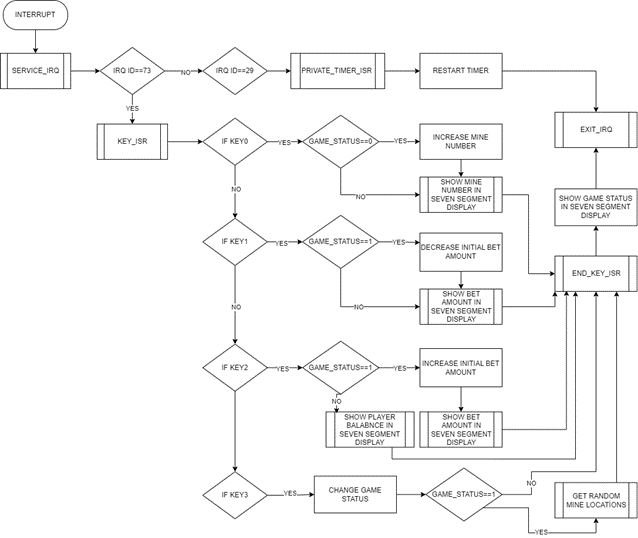

# BetMine Game README

## 1. Cpulator Setup

[Try yourself](https://cpulator.01xz.net/?sys=arm-de1soc)

## 2. Description
The BetMine game involves managing a balance system, placing bets, avoiding mines, and using LEDs and switches to interact with the game. Players start with an initial balance and bet amount, which they can adjust before starting the game. The main goal is to clear the minefield without hitting any mines, utilizing strategic betting to maximize winnings.

### Initial Setup
All instructions for Initial Setup:
- Balance: You start with a balance of 300 units.
- Bet Amount: The initial bet amount is set at 50 units.
- Number of Mines: Initially set to zero but can be adjusted using game controls. Also, if it is not set, the game starts with 1 mine.
- Minefield Status: The game continuously monitors the minefield and updates the LEDs to reflect cleared locations.
- Balance Management: Your balance is dynamically updated based on game outcomes, allowing you to strategize your bets in subsequent rounds.

## 3. Game Elements
- LEDs: Indicate the cleared locations on the minefield.
- Switches: Used to select and clear locations.
- 7-Segment Display: Shows the game status, current number of mines, bet amount, and balance.
- KEYS: changes the game status, current number of mines, bet amount.

### Game Controls
- KEY0: If game status is zero, increase the number of mines (range: 1-7). Otherwise, it shows the number of mines.
- KEY1: If the game status is 1, decrease the bet amount by 10 units (minimum bet amount: 10 units). Otherwise, show the bet amount.
- KEY2: If the game status is 1, increase the bet amount by 10 units (maximum bet amount: 100 units). Otherwise, show the total budget.
- KEY3: Starts the game after setting the number of mines and bet amount or advance to the next stage.

### Game Conditions
- **Win Condition:** If you successfully clear all mines, the game enters a win state. LEDs will light up in a specific sequence to indicate a win. The bet amount is added to the budget.
- **Lose Condition:** If you hit a mine, the game enters a lost state. LEDs will light up in a different sequence to indicate a loss.

### Resetting and Restarting
After winning or losing, you can reset the game variables and start a new game. Use the buttons to set the number of mines and bet amount again.

## 4. Gameflow
The game begins with the configuration of the interrupts, which are used to control the game. There are three states in the game:
1. Setting the Mine Number: In this initial state, the player sets the number of mines.
2. Choosing the Bet Amount: The game then transitions to this state, where the player selects the bet amount.
3. Gameplay: After the configuration states, the game enters the gameplay state, where the player can turn switches to clear the mines.

Using different states ensures that players can only perform specific actions within each state. For example, a player cannot change the bet amount in the first or third states.

In the gameplay state, if a player encounters a mine, the game enters the LOST_SEQUENCE. This sequence highlights the mine locations by flashing the LEDs on and off. Conversely, if a player successfully clears all the mines, the game transitions to the WIN_SEQUENCE, where the mine locations are also displayed using the LEDs. To start a new round, all necessary variables are reset using the CHECK_OUT function. In addition, players can end the game anytime they want and checkout with the earnings.

## 5. Flowcharts

## 6. Figures
### Figure1: Game status0

### Figure2: Game status1. For debugging purposes, mine location is shown in the LEDs before the game starts.

### Figure3: Game status2

### Figure4: if a player has not enough balance to play

### Figure5: To play the normal game in GET_MINE_LOCATIONS_BIT subroutine comment out this part

### Figure6: 
